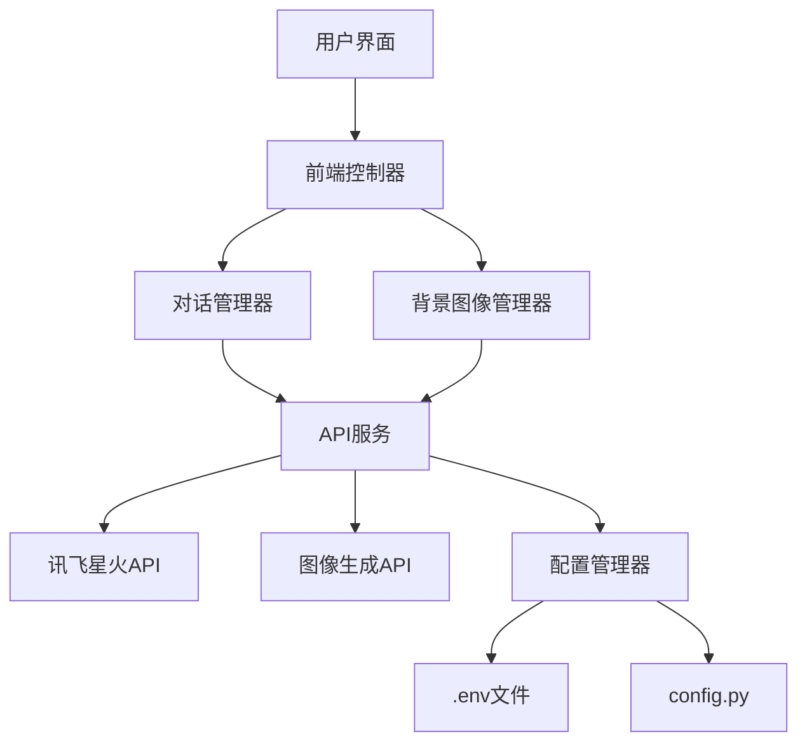

# 设计文档

## 概述

CABM（Code Afflatus & Beyond Matter）是一个AI对话应用，具有动态生成的背景图片功能。该应用允许用户与AI模型进行对话交流，同时使用图像生成模型创建的图片作为背景，提供沉浸式体验。应用采用前后端分离架构，后端处理API调用和数据管理，前端提供用户界面和交互功能。

## 架构

应用采用以下架构设计：



### 核心组件

1. **前端界面**：基于HTML, CSS和JavaScript构建的Web界面
2. **后端服务**：基于Python的Flask应用，处理API调用和业务逻辑
3. **配置管理**：处理环境变量和配置文件
4. **API服务**：封装对外部API的调用
5. **图像管理**：处理图像生成、下载和存储

## 组件和接口

### 1. 配置管理组件

负责加载和管理应用配置，包括API密钥、URL和模型参数。

**接口**:
- `load_config()`: 加载配置文件和环境变量
- `get_config(key)`: 获取特定配置项
- `validate_config()`: 验证配置完整性

### 2. API服务组件

封装对外部API的调用，处理认证和错误处理。

**接口**:
- `chat_completion(messages, stream=False)`: 调用对话API
- `generate_image(prompt, settings)`: 调用图像生成API
- `handle_api_error(response)`: 处理API错误

### 3. 对话管理组件

管理用户与AI的对话，维护对话历史。

**接口**:
- `add_message(role, content)`: 添加新消息
- `get_history()`: 获取对话历史
- `clear_history()`: 清空对话历史
- `format_messages()`: 格式化消息以适应API要求

### 4. 图像管理组件

处理图像生成、下载和存储。

**接口**:
- `generate_background(prompt=None)`: 生成新背景
- `download_image(url)`: 下载图像
- `get_random_prompt()`: 获取随机图像提示词
- `get_current_background()`: 获取当前背景图片路径

### 5. 前端控制器

协调前端组件和用户交互。

**接口**:
- `send_message(content)`: 发送用户消息
- `update_background()`: 更新背景图片
- `display_message(message)`: 显示消息
- `handle_error(error)`: 处理错误显示

## 数据模型

### 1. 消息模型

```python
class Message:
    role: str  # "system", "user", "assistant"
    content: str  # 消息内容
    timestamp: datetime  # 消息时间戳
```

### 2. 对话历史模型

```python
class ChatHistory:
    messages: List[Message]  # 消息列表
    model: str  # 使用的模型
```

### 3. 图像配置模型

```python
class ImageConfig:
    prompt: str  # 图像提示词
    image_size: str  # 图像尺寸
    guidance_scale: float  # 引导比例
    negative_prompt: str  # 负面提示词
    seed: int  # 随机种子
```

### 4. 应用配置模型

```python
class AppConfig:
    chat_api_url: str  # 对话API URL
    image_api_url: str  # 图像API URL
    chat_api_key: str  # 对话API密钥
    image_api_key: str  # 图像API密钥
    chat_model: str  # 对话模型名称
    image_model: str  # 图像模型名称
    system_prompts: Dict[str, str]  # 系统提示词
```

## 错误处理

应用将实现以下错误处理策略：

1. **API错误处理**：
   - 网络连接错误：重试机制，最多尝试3次
   - 认证错误：提示用户检查API密钥
   - 服务器错误：显示友好错误信息

2. **配置错误处理**：
   - 缺失配置：提供明确的错误信息和配置指南
   - 格式错误：验证配置格式并提供修复建议

3. **图像处理错误**：
   - 下载失败：使用缓存的备用图像
   - 生成失败：使用默认背景并记录错误

4. **用户界面错误处理**：
   - 输入验证：防止空消息和过长消息
   - 加载状态：显示加载指示器避免用户重复操作

## 测试策略

应用将采用以下测试策略：

1. **单元测试**：
   - 测试各组件的独立功能
   - 模拟API响应进行测试
   - 测试配置加载和验证

2. **集成测试**：
   - 测试组件间的交互
   - 测试前后端通信
   - 测试错误处理流程

3. **端到端测试**：
   - 测试完整用户流程
   - 测试响应式设计
   - 测试不同浏览器兼容性

## 文件结构

```
cabm/
├── .env                  # 环境变量（API密钥等）
├── .gitignore            # Git忽略文件
├── config.py             # 配置文件
├── app.py                # 主应用入口
├── static/               # 静态资源
│   ├── css/              # 样式文件
│   ├── js/               # JavaScript文件
│   └── images/           # 图片资源和缓存
├── templates/            # HTML模板
├── services/             # 服务组件
│   ├── chat_service.py   # 对话服务
│   ├── image_service.py  # 图像服务
│   └── config_service.py # 配置服务
└── utils/                # 工具函数
    ├── api_utils.py      # API工具
    └── error_utils.py    # 错误处理工具
```

## 安全考虑

1. **API密钥保护**：
   - 使用.env文件存储API密钥
   - 确保.gitignore排除.env文件
   - 不在前端暴露API密钥

2. **输入验证**：
   - 验证用户输入防止注入攻击
   - 限制请求频率防止滥用

3. **错误信息**：
   - 不向用户暴露敏感的错误详情
   - 使用通用错误消息

## 扩展性考虑

1. **模型切换**：
   - 设计允许轻松切换不同的AI模型
   - 通过配置文件控制模型参数

2. **多语言支持**：
   - 设计支持多语言界面
   - 支持不同语言的提示词

3. **自定义主题**：
   - 允许用户自定义界面主题
   - 支持保存用户偏好设置