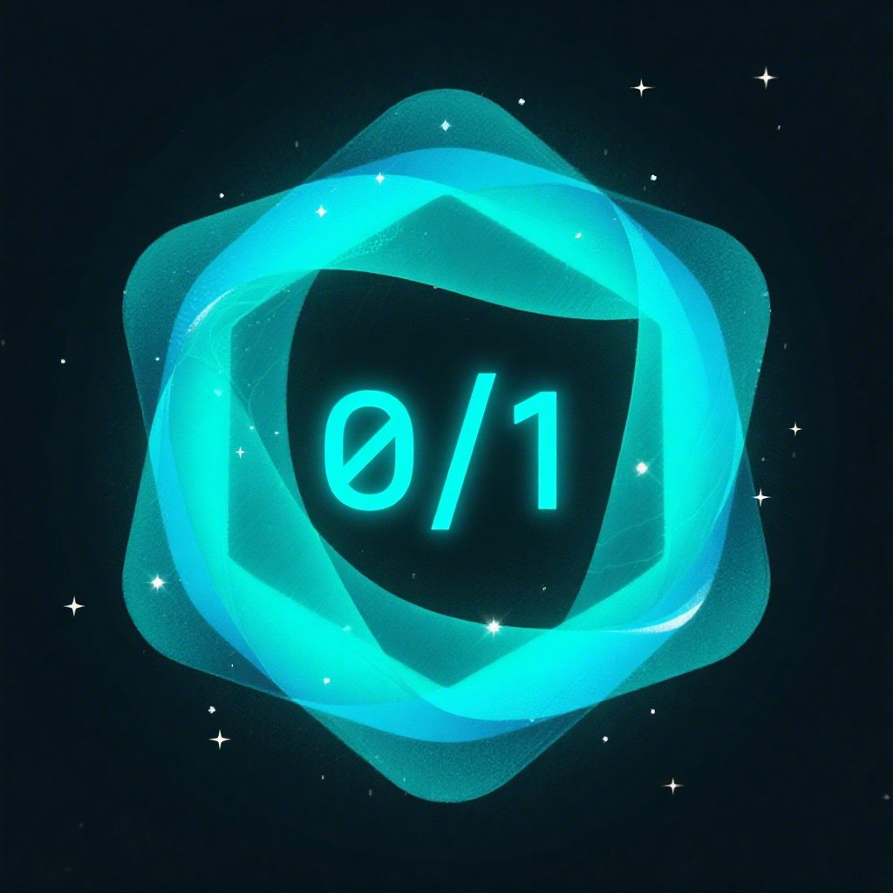

# CABM - Code Afflatus & Beyond Matter
## 看板娘 - 灵音

画师：AI

由于某些原因，她和`初音未来`有亿点相似，但是这是几百张里最好的了……~~其实还有一张更好的，但是可能过不了审。~~
## [意义与遐想](docs/meaning.md)
"当灵性注入载体，它便挣脱物质躯壳，抵达超验之境。"

~~（不就是个Gal吗）~~

---

## [项目网站](https://leletxh.github.io)

## 项目简介
CABM（Code Afflatus & Beyond Matter）是一个融合先进AI技术的沉浸式对话应用，用户可以与AI角色进行深度互动，体验类似视觉小说(Galgame)的情感化叙事。项目结合了大型语言模型、检索增强生成、语音合成等技术，提供：

- **智能角色系统**：每个角色拥有独特人格、背景故事和情感表达
- **动态叙事体验**：剧情模式根据用户选择推动故事发展
- **情感驱动交互**：每个角色有多个立绘，根据情绪实时调整
- **多模态输出**：支持文本、语音、表情立绘的同步呈现
- **长期记忆系统**：向量数据库存储对话历史，让角色永远记得和你的故事
- **高度可定制**：用户可创建自定义角色

## 开发状态
> ### **⚠️ 注意：本项目目前处于开发阶段，核心功能已经实现（可能吧？），其他的功能和优化也正在进行中。欢迎贡献代码或提出建议。**

**待修复的bug：**
- （重要）多角色模式下聊天框里角色名更新有延迟
- （重要）多角色模式的检索词
- （特性）故事模式回调那边的那坨史山（能跑就行）
- （特性）进入聊天页面时背景变暗
- （特性）话说一半查看历史会显示完整对话
- （特性）加载角色时文件无法加载（浏览器安全限制）
- （特性）electron上，关闭logo选项无效

**已完成功能：**
- 基本的AI对话功能，包含最近的历史记录
- 前端的主页面（现在是科幻风了）
- 角色系统（可切换不同角色）
- 分段流式输出（灵魂所在~）
- 记忆系统（使用向量数据库长期保存记忆）
- AI生成选项
- 简单的角色动作（呼吸）
- 多立绘实现角色不同表情
- 自定义角色
- 支持多角色的剧情模式（根据大纲推动故事发展）
- 角色的知识库（背景故事、人物细节等）
- ~~语音输入~~（目前几乎用不了）
- 很多的bug

**正在开发：**
- 故事结束后的处理
- 用户输入动画（以拖时间）
- 背景资源管理
- 场景切换（让AI切换场景或生成新场景）
- 角色关系网（角色对其他角色的印象）
- 多个参考音频（不同心情使用对应的参考音频）
- 更好的语音输入（使用API）
- ~~MCP调用~~（暂不考虑）
- 移动端适配
- 更好的记忆系统
- 更多的bug

## 声明
- 本项目为个人非营利性兴趣项目，无意且不参与任何形式的同业竞争
- 本项目采用GNU通用公共许可证(GPL)开源协议，详见[GNU General Public License v3.0](LICENSE)
- 使用者需自行承担因调用第三方AI服务产生的API费用，此类费用与项目作者无关
- 作者与文档中提及的任何第三方服务平台或公司均无商业关联或授权关系
- 本项目涉及人工智能生成内容，作者不对AI生成内容的准确性、合法性及可能引发的后果承担任何责任。
- 欢迎提出建设性意见或提交Pull Requests，但作者保留是否采纳的最终决定权，建议提前和作者联系。
- 作者保留对本声明条款的最终解释权及修改权。

## 功能特点

- 与AI模型进行自然对话，流式输出
- 多角色系统，可切换不同的AI角色
- 动态生成背景图片，提供沉浸式体验
- 角色立绘动态显示，增强视觉效果
- 语音合成，多模态输出
- 对话历史记录查看
- 响应式设计，适配不同设备

## 安装说明

### 🎮方法一：无脑安装（仅限Windows）
1. [点击下载安装包](https://github.com/leletxh/CABM-run/releases/download/V1.1.1/-V1.1.1-win-x64.zip)
2. 解压
3. 双击“启动器.exe”
4. 去[硅基流动平台](https://cloud.siliconflow.cn/i/mVqMyTZk)申请你的API密钥
5. 在出现的窗口里填入你的API密钥（共5处）
6. 点击确认
7. 重新双击“启动器.exe”

> 步骤**4**的详细操作：
>1.  [点击这里](https://cloud.siliconflow.cn/i/mVqMyTZk)，然后注册账号
>2. 点击左下角的“API密钥”
>3. 点击左上角的“新建API密钥”
>4. 描述随便写，然后点击“新建密钥”
>5. 点击密钥进行复制

### 🐳方法二：Docker 快速部署
[点击查看](docs/Docker_Method.md)

### 📦方法三：传统安装方式（适合开发者）
[点击查看](docs/Traditional_Method.md)

### ✨可选安装
- 如果你有独立显卡，推荐[使用GPT-SoVITS语音合成](docs/TTS_GPTSoVITS.md)（因为硅基流动的TTS太贵了）
- Node.js 安装与启动（带UI界面）[点击查看](docs/NodeJS.md)
## 使用说明

### 启动应用

#### Windows

双击 `start.bat` 文件或在命令行中运行
```bash
./start.bat
```

#### Linux/macOS

确保脚本有执行权限：

```bash
chmod +x start.sh
```

然后运行：

```bash
./start.sh
```

#### 高级选项

你也可以直接使用Python启动脚本，并传递额外的参数：

```bash
python start.py --host 127.0.0.1 --port 8080 --debug --no-browser
```

可用参数：
- `--host`: 指定主机地址（默认为配置文件中的值）
- `--port`: 指定端口号（默认为配置文件中的值）
- `--debug`: 启用调试模式
- `--no-browser`: 不自动打开浏览器

启动后，应用会自动在浏览器中打开。程序会智能选择最合适的本地IP地址（优先使用192.168开头的地址），确保在各种浏览器中都能正常访问。

你也可以手动访问以下地址：
- 本地访问：`http://localhost:5000` 或 `http://127.0.0.1:5000`
- 局域网访问：`http://[你的本地IP]:5000`（启动时会显示具体地址）

### 基本操作

- **发送消息**：在右上角输入框中输入消息，点击"发送"按钮或按回车键发送
- **查看历史**：点击"历史"按钮查看对话历史
- **播放语音**：点击"播放语音"按钮再次播放语音
- **更换背景**：点击"更换背景"按钮选择背景或生成新的背景图片

## 自定义内容
### 自定义角色
#### 可以到[我们群里](https://qm.qq.com/q/oi33LF73jy)获取角色包导入
也可以在前端UI自定义角色，你需要准备：
- 角色的**无背景**立绘（如果有多个，尽量保持角色的大小相同）
- 角色的简介（包括给人看的和给AI看的）
- 角色的一句语音及其文本，3-10秒（以使用语音功能）
- 角色的详细信息、背景故事等等，需要按要求整理好（非必须）
#### [点击查看详细说明](docs/custom_character.md)

### 自定义bgm
直接在资源管理里上传，支持音频类型文件

### 自定义背景
直接在资源管理里上传，支持图片类型文件

## 其他注意事项
- 手机可以访问，但是排版会有问题
- bgm有时可能会出现二重奏，尝试刷新一下

## 贡献
> 注：按周结算没有并不代表没有

[](https://github.com/xhc2008/CABM/graphs/contributors) 

 

欢迎提交 Pull Request 或 Issue！~~(但不一定会做)~~

具体贡献流程请参考[CONTRIBUTING.md](CONTRIBUTING.md)

## 📚 文档索引

### 部署文档
- [📖 Docker 镜像直接拉取部署指南](docs/DOCKER_PULL_GUIDE.md) - **推荐：无需源码，直接拉取镜像部署**
- [Docker 部署指南](docs/DOCKER_DEPLOY_GUIDE.md) - 完整的 Docker 部署指南
- [Docker 部署方案](docs/DOCKER_DEPLOYMENT.md) - Docker 部署详细说明
- [Windows 部署指南](docs/WINDOWS_DEPLOY_GUIDE.md) - Windows 环境部署
- [Docker 问题解决方案](docs/DOCKER_SOLUTION.md) - 常见问题及解决方案

### 功能文档
- [TTS GPT-SoVITS 配置](docs/TTS_GPTSoVITS.md) - 语音合成服务配置

### 开发文档
- [贡献指南](CONTRIBUTING.md) - 如何参与项目开发

## 许可证

[GNU General Public License v3.0](LICENSE)
<br />
<br />
<br />
<br />
<br />
<br />
<br />
<br />
<br />
<br />
<br />
<br />
<br />
<br />
<br />
<br />
<br />
<br />
<br />
<br />
<br />
<br />
<br />
<br />
<br />
<br />
<br />
<br />
<br />
<br />
<br />
<br />
<br />
<br />
<br />
<br />
<br />
<br />
<br />
<br />
<br />
<br />
<br />
<br />
<br />
<br />
<br />
<br />
<br />
<br />
<br />
<br />
<br />
<br />
<br />
<br />
<br />
<br />
<br />
<br />
<br />
<br />
<br />
<br />
<br />
<br />
<br />
<br />
<br />
<br />
<br />
<br />
<br />
<br />
<br />
<br />
<br />
<br />
<br />
<br />
<br />
<br />
<br />
<br />
<br />
<br />
<br />
<br />
<br />
<br />
<br />
<br />
<br />
<br />
<br />
<br />
<br />
<br />
<br />
<br />
<br />
<br />
<br />
<br />
<br />
<br />
<br />
<br />
<br />
<br />
<br />
<br />
<br />
<br />
<br />
<br />
<br />
<br />
<br />
<br />
<br />
<br />
<br />
<br />
<br />
<br />
<br />
<br />
<br />
<br />
<br />
<br />
<br />
<br />
<br />
<br />
<br />
<br />
<br />
<br />
<br />
<br />
<br />
<br />
<br />
<br />
<br />
<br />
<br />
<br />
<br />
<br />
<br />
<br />
<br />
<br />
<br />
<br />
<br />
<br />
<br />
<br />
<br />
<br />
<br />
<br />
<br />
<br />
<br />
<br />
<br />
<br />
<br />
<br />
<br />
<br />
<br />
<br />
<br />
<br />
<br />
<br />
<br />
<br />
<br />
<br />
<br />
<br />
<br />
<br />
<br />
<br />
<br />
<br />
<br />
<br />
<br />
<br />
<br />
<br />
<br />
<br />
<br />
<br />
<br />
<br />
<br />
<br />
<br />
<br />
<br />
<br />
<br />
<br />
<br />
<br />
<br />
<br />
<br />
<br />
<br />
<br />
<br />
<br />
<br />
<br />
<br />
<br />
<br />
<br />
<br />
<br />
<br />
<br />
<br />
<br />
<br />
<br />
<br />
<br />
<br />
<br />
<br />
<br />
<br />
<br />
<br />
<br />
<br />
<br />
<br />
<br />
<br />
<br />
<br />
<br />
<br />
<br />
<br />
<br />
<br />
<br />
<br />
<br />
<br />
<br />
<br />
<br />
<br />
<br />
<br />
<br />
<br />
<br />
<br />
<br />
<br />
<br />
<br />
<br />
<br />
<br />
<br />
<br />
<br />
<br />
<br />
<br />
<br />
<br />
<br />
<br />
<br />
<br />
<br />
<br />
<br />
<br />
<br />
<br />
<br />
<br />
<br />
<br />
<br />
<br />
<br />
<br />
<br />

# 恭喜你读完了整篇README收下彩蛋吧
[彩蛋](https://www.yuanshen.com/#/)
